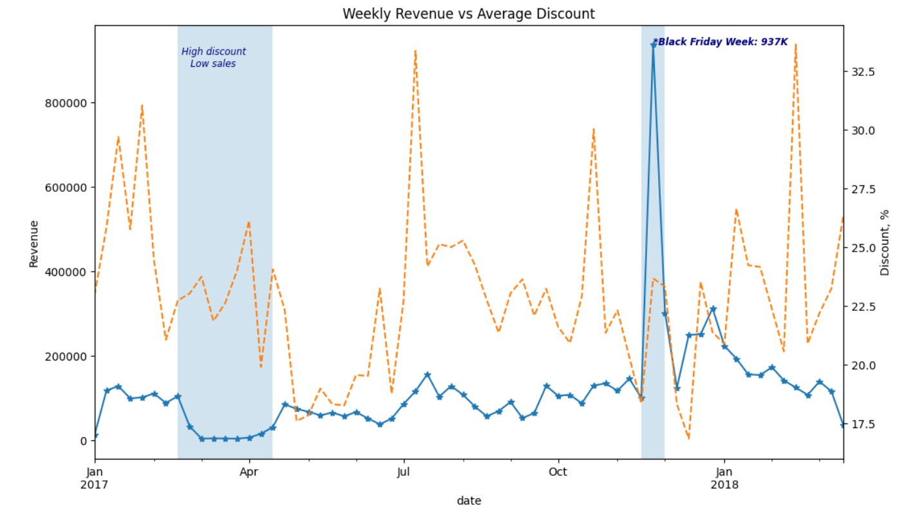

# ecommerce-discount-strategy-analysis
# E-commerce Pricing & Discount Analysis
## Project Overview
This project analyses pricing, discount strategies, and sales performance for an e-commerce retailer. The business faced a strategic question: do discounts generate sustainable revenue growth, or do they simply increase order volume while eroding sales value? 
- The analysis focuses on:
- Revenue trends over time
- Discount distribution and discount costs
- Top-performing categories and brands
- Revenue concentration across product groups
- Relationship between discounts and sales metrics
The objective is to provide data-driven insights that help evaluate whether discounting supports sustainable revenue growth or primarily drives short-term increases in sales volume. 
## Dataset & Sources
Source: Eniac E-commerce Dataset
#### Datasets Used:
- Orders: 226,909 orders
- Orderlines: 293,983 transaction lines
- Products: 19,326 products
- Brands: 187 brands
Timeframe: January 2017 – March 2018
Final Analytical Dataset: ~50,000 completed transaction lines after data cleaning and filtering
#### Key Features:
- Order ID
- Transaction Date
- Product SKU
- Product Quantity
- Unit Price
- Product Price
- Revenue
- Discount Amount
- Discount Percentage
- Product Category
- Brand
- Order Status
## Data Preparation
Significant data cleaning was required due to inconsistent pricing formats, missing values, and structural mismatches across orders and products.
#### Data Cleaning
- Removed cancelled and duplicated orders
- Filtered inconsistent transactions
- Converted date fields to datetime format
- Handled missing values in product categories and brands
#### Created additional analytical features:Created additional analytical features:
- Revenue
- Discount Amount
- Discount Percentage
- Total Discount Cost
- Weekly Revenue
- Average Order Value (AOV)

## Key Findings
- Higher discounts were not consistently associated with higher revenue.
- Revenue peaks were primarily linked to seasonal events rather than discount levels.
- A small number of categories and brands generated the majority of total revenue.
- Several top-performing brands achieved strong sales with moderate discounting.
- The analysis suggests that discounts may increase sales volume, but are not sufficient on their own to drive sustainable revenue growth.

## Tools & Technologies
- Python
- Pandas
- Seaborn
- Google Colab
- GitHub

##  Visualisations
 *Strong Seasonality: Highest sales activity observed during Black Friday & Christmas season*

